*Relazione Ingegneria del software anno 2017/2018*
---------------------------------------------------------------------
# Gruppo di lavoro: Ritchie
  - **_Adrulli Nunzia_**:  mat. _655686_
  - **_Bruno Luciano_**: mat. _652857_
  - **_Colagrande Pierpasquale_**: mat. _651504_
  - **_Debellis Rocco_**: mat. _656530_
  - **_Lupoli Michele_**: mat. _637427_

# Indice
1) Introduzione
   - Cos'è Slack? 
   - Cos'è Sna4Slack?
   - Goal del progetto
2) Modello concettuale Sna4Slack
3) Requisiti specifici Sna4Slack 
   - Requisiti funzionali
   - Requisiti non funzionali		
4) Architettura Sna4Slack
   - Stile architetturale adottato
   - Diagramma dei package
   - Diagramma dei componenti
   - Commenti relativi alle decisioni prese
5) System Design Sna4Slack
   - Diagramma delle classi e diagramma di sequenza riportato per ogni requisito funzionale.
   - Menzionare l'eventuale applicazione di design pattern
   - Giustificare le segnalazioni rimaste aperte di PMD
   - Commenti riguardo alle decisioni prese
6) Riepilogo dei test su Sna4Slack
7) Manuale utente Sna4Slack
8) Processo di sviluppo e organizzazione del lavoro
   - Stile di processo adottato
   - Metodologia utilizzata per strutturare lo sviluppo dell'applicazione
   - Confronto tra il manifesto dello sviluppo agile e il lavoro svolto
   - Framework Scrum
   - Ruoli
   - Eventi
   - Artifact
9) Analisi retrospettiva
   - Cosa ha funzionato bene e rifaremmo in futuro?	
   - Cosa non ha funzionato bene e non rifaremmo in futuro? 
   - Cosa faremmo di nuovo?

# 1. Introduzione
## Che cos'è Slack?
Slack è un software che rientra nella categoria degli strumenti di collaborazione aziendale utilizzato per  inviare messaggi in modo istantaneo ai membri del team.
Una delle funzioni di Slack è la possibilità di organizzare la comunicazione del team attraverso canali specifici.
I canali potranno essere accessibili a tutto il team o solo ad alcuni membri.
È possibile comunicare con i membri del team anche attraverso chat individuali private o chat con due o più membri.
Grazie all'integrazione con diverse applicazioni è possibile aumentare le prestazioni del software e la produttività del team.
All'interno della piattaforma possiamo utilizzare  Google Drive,  GitHub ,  Google Calendar ed altre applicazioni popolari.
Slack è fruibile da tutti i dispositivi iOs, Android, Windows, come applicazione e da web browser.

## Che cos'è Sna4Slack ?

Sna4Slack è un progetto in cui ci si prepone di sviluppare un'applicazione che consente agli utenti di analizzare i dati relativi alle conversazioni avvenute in un workspace Slack.
I dati di origine arriveranno dagli archivi di esportazione Slack.
L'applicazione prende il nome del progetto.
Tramite l'applicazione un utente in possesso di un workspace Slack, e di alcune informazioni relative al workspace di cui si è in possesso, come nome di channel o di membri, potrà visualizzare le seguenti informazioni conoscendo gli appositi comandi dell'applicazione o facendosi guidare dall'help dell'applicazione :

- la lista dei Member.
- la lista dei Channel.
- la lista dei Member raggruppati per Channel.
- la lista dei Member di un Channel.
- informazioni di help.
- la lista dei @mention.
- la lista dei @mention che partono da uno User.
- la lista dei @mention che arrivano a uno User.
- la lista pesata dei @mention.
- la lista pesata dei @mention che partono da uno User.
- la lista pesata dei @mention che arrivano a uno User.

## Goal del progetto 

Realizzare un applicazione denominata Sna4Slack che rispetti a pieno tutti i requisiti funzionali e non che si andranno a definire.
Lo sviluppo dell'applicazione sarà supportato da un sistema di controllo versione nel caso specifico GitHub.
Nella realizzazione dell'applicazione bisogna rimanere il più fedeli possibile ai principi di ingegneria del software e di OO design.
I principali principi di OO design che ci siamo preposti di rispettare sono :
- Information hiding
- Alta coesione
- Basso accoppiamento
- Do Not Repeat Yourself (DRY)
- Legge di Demetra (Do not talk to strangers)
- Principi SOLID

I principali principi di ingegneria del software che ci siamo preposti di rispettare sono stati quelli riportatati nel manifesto agile e quelli riportati a lezione da professore.

# 2. Modello concettuale
ll modello di dominio è utile per comprendere e comunicare i concetti fondamentali di un dominio (ambito).
E’ indipendente dal software è anche detto “modello concettuale”.
Per rappresentarlo si utilizza un diagramma delle classi con prospettiva concettuale (rappresentazione visuale di concetti caratteristici del dominio studiato).
Una classe rappresenta un concetto ben definito che permette l’astrazione di oggetti (o istanze) simili.
Le proprietà di una classe: attributi, associazioni.

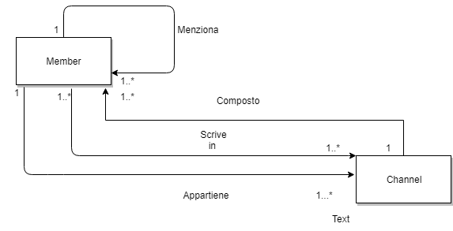

# 3. Requisiti specifici
Un requisito è una caratteristica o condizione che un sistema è tenuto a rispettare.
La formulazione dei requisiti chiarisce il modo in cui i bisogni dei committenti o utenti dovranno essere soddisfatti dai progettisti.
L’insieme dei requisiti delimita lo spazio delle soluzioni ammissibili. 
Essi si dividono in:
- _**Requisiti funzionali (detti anche “features”).**_
- _**Requisiti non funzionali : affidabilità, efficienza, usabilità, manutenibilità, portabilità.**_

Gli stili di descrizione dei requisiti specifici sono fondamentalmente : uso del predicato verbale (per requisiti funzionali e non), user story (solo per requisiti funzionali) e casi d'uso  (solo per requisiti funzionali).

## Requisiti funzionali Sna4Slack
Di seguito vengono elencati i  requisiti funzionali e per ciascuno i propri criteri di accettazione.

**In qualità di utente voglio visualizzare la lista dei Member.**
- Verificare che sia possibile fare la richiesta da linea di comando
- Verificare che l'output sia visualizzato su standard output
- Verificare che sia possibile specificare il workspace con il nome completo del file zippato, con il percorso assoluto o relativo
- Verificare che ci sia un file esportato associato al workspace
- Verificare che i _Member_ siano visualizzati uno per riga
- Verificare che non siano visualizzati _Member_ estranei al workspace

<table>
  <tr>
    <td>Codice caso d'uso</td>
      <td>Nome</td>
      <td>Attori</td>
      <td>Obiettivo</td>
      <td>Pre-condizioni</td> 
      <td>Post-condizioni</td>
  </tr>
  <tr>
      <td>UC01</td>
      <td>Lista Member</td>
      <td>Utente</td>
      <td>Visualizzare la lista di tutti i Member del workspace specificato</td>
      <td>Il nome del worksppace specificato è realmente esistente esistente</td> 
      <td>La lista dei Members viene visualizzata a video</td>
  </tr>
  <tr>
   <td>UC02</td>
      <td>Lista Member</td>
      <td>Utente</td>
      <td>Visualizzare la lista di tutti i Member del workspace specificato</td>
      <td>Il nome del worksppace specificato non è realmente esistente esistente</td> 
      <td>La lista dei member non viene visualizzata a video</td>
  </tr>
  
</table>

**In qualità di utente voglio visualizzare la lista dei Channel.**
- Verificare che sia possibile fare la richiesta da linea di comando
- Verificare che l'output sia visualizzato su standard output
- Verificare che sia possibile specificare il workspace con il nome completo del file zippato, con il percorso assoluto o relativo
- Verificare che ci sia un file esportato associato al workspace
- Verificare che i _Channel_ siano visualizzati uno per riga
- Verificare che i _Channel_ del workspace siano tutti presenti
- Verificare che non siano visualizzati _Channel_ estranei al workspace

<table>
  <tr>
    <td>Codice caso d'uso</td>
      <td>Nome</td>
      <td>Attori</td>
      <td>Obiettivo</td>
      <td>Pre-condizioni</td> 
      <td>Post-condizioni</td>
  </tr>
  <tr>
      <td>UC03</td>
      <td>Lista dei Channel</td>
      <td>Utente</td>
      <td>Visualizzare la lista di tutti i Channel del workspace specificato</td>
      <td>Il nome del worksppace specificato è realmente esistente esistente</td> 
      <td>La lista dei Channel è visualizzata a video</td>
  </tr>
  <tr>
      <td>UC04</td>
      <td>Lista dei Channel</td>
      <td>Utente</td>
      <td>Visualizzare la lista di tutti i Channel del workspace specificato</td>
      <td>Il nome del worksppace specificato non è realmente esistente esistente</td> 
      <td>La lista dei Channel non viene visualizzata a video</td>
  </tr>
  
</table>

**In qualità di utente voglio visualizzare la lista dei Member raggruppati per Channel.**
- Verificare che sia possibile fare la richiesta da linea di comando
- Verificare che l'output sia visualizzato su standard output
- Verificare che sia possibile specificare il workspace con il nome completo del file zippato, con il percorso assoluto o relativo
- Verificare che ci sia un file esportato associato al workspace
- Verificare che i _Member_ e _Channel_ siano visualizzati uno per 
riga, con i _Member_ visualizzati subito dopo il _Channel_ a cui appartengono
- Verificare che sia possibile distinguere quale nome è un _Member_ e quale è un _Channel_
- Verificare che i _Channel_ siano tutti presenti
- Verificare che non siano visualizzati _Channel_ estranei al workspace

<table>
  <tr>
    <td>Codice caso d'uso</td>
      <td>Nome</td>
      <td>Attori</td>
      <td>Obiettivo</td>
      <td>Pre-condizioni</td> 
      <td>Post-condizioni</td>
  </tr>
  <tr>
      <td>UC05</td>
      <td>Lista dei Member per channel</td>
      <td>Utente</td>
      <td>Visualizzare la lista di tutti i Member del workspace specificato raggruppati per channel</td>
      <td>Il nome del Channel specificato è realmente esistente esistente</td>  
      <td>La lista dei member raggruppati per channel è visualizzata a video</td>
  </tr>
  <tr>
   <td>UC06</td>
      <td>Visualizzazione lista Member raggruppati per channel</td>
      <td>Utente</td>
      <td>Visualizzare la lista di tutti i Member del workspace specificato raggruppati per channel</td>
      <td>Il nome del Channel specificato non è realmente esistente esistente</td>  
      <td>La lista dei member raggruppati per channel non viene visualizzata a video</td>
  </tr>
  
</table>

**In qualità di utente voglio visualizzare la lista dei Member di un Channel.**
- Verificare che sia possibile fare la richiesta da linea di comando
- Verificare che l'output sia visualizzato su standard output
- Verificare che sia possibile specificare il workspace con il nome completo del file zippato, con il percorso assoluto o relativo
- Verificare che ci sia un file esportato associato al workspace
- Verificare che sia possibile specificare il _Channel_
- Verificare che i _Member_ siano visualizzati uno per riga dopo il _Channel_ specificato
- Verificare che i _Member_ del _Channel_ specificato siano tutti presenti 
- Verificare che non siano visualizzati _Member_ estranei al _Channel_ specificato

<table>
  <tr>
    <td>Codice caso d'uso</td>
      <td>Nome</td>
      <td>Attori</td>
      <td>Obiettivo</td>
      <td>Pre-condizioni</td> 
      <td>Post-condizioni</td>
  </tr>
  <tr>
      <td>UC07</td>
      <td>Lista dei Member di un channel</td>
      <td>Utente</td>
      <td>Visualizzare la lista di tutti i Member di uno specifico channel</td>
      <td>Il nome del channel specificato è realmente esistente esistente</td>  
      <td>La lista dei member  di uno specifico channel è visualizzata a video</td>
  </tr>
  <tr>
   <td>UC08</td>
      <td>Lista Member di un channel</td>
      <td>Utente</td>
      <td>Visualizzare la lista di tutti i Member si uno specificato channel</td>
      <td>Il nome del channel specificato non è realmente esistente esistente</td>  
      <td>La lista dei member di un channel non viene visualizzata a video</td>
  </tr>
  
</table>

**In qualità di utente voglio poter avere informazioni di help.**
- Verificare che l'help possa essere richiesto digitando il nome del programma senza parametri aggiuntivi 
- Verificare che l'help sia suggerito se un comando digitato non è valido
- Verificare l'help sia mostrato su standard outpu
- Verificare che siano presenti i comandi per tutte le funzionalità

<table>
  <tr>
    <td>Codice caso d'uso</td>
      <td>Nome</td>
      <td>Attori</td>
      <td>Obiettivo</td>
      <td>Pre-condizioni</td> 
      <td>Post-condizioni</td>
  </tr>
  <tr>
      <td>UC09</td>
      <td>Informazioni help</td>
      <td>Utente</td>
      <td>Visualizzare la lista di comandi possibili</td>
      <td>Il nome del programma non è seguito da parametri specifici</td> 
      <td>Lista di tutti i comandi del programma</td>
  </tr> 
</table>

**In qualità di utente voglio visualizzare la lista dei @mention.**
- Verificare che per ogni @mention sia visualizzata una riga con la coppia
**(From, To)**  dove  _From_  è lo User che scrive il messaggio con il @mention e  _To_  è lo User menzionato
- Verificare che le coppie **(From, To)** non siano ripetute
- Verificare che le coppie  **(From, To)** corrispondenti a un @mention siano tutte presenti
- Verificare che siano visualizzate solo coppie **(From, To)** corrispondenti a un @mention
- Verificare che sia possibile specificare il _Channel_ e, nel caso sia specificato, la lista sia ristretta ai soli @mention del Channel

<table>
  <tr>
    <td>Codice caso d'uso</td>
      <td>Nome</td>
      <td>Attori</td>
      <td>Obiettivo</td>
      <td>Pre-condizioni</td> 
      <td>Post-condizioni</td>
  </tr>
  <tr>
      <td>UC010</td>
      <td>Lista Mention From_To</td>
      <td>Utente</td>
      <td>Visualizzare la lista di tutti i Mention specificando il member da cui parte la mention e il member a cui giunge la mantion</td>
      <td>Il nome del worksppace specificato è realmente esistente</td> 
      <td>La lista di tutte le mantion in formato From To viene visualizzata a video</td>
  </tr>
  <tr>
      <td>UC011</td>
      <td>Lista Mention From_To</td>
      <td>Utente</td>
      <td>Visualizzare la lista di tutti i Mention specificando il member da cui parte la mention e il member a cui giunge la mantion</td>
      <td>Il nome del worksppace specificato non è realmente esistente</td> 
      <td>La lista di tutte le mantion in formato From To non è visualizzata a video</td>
  </tr>
  
</table>

**In qualità di utente voglio visualizzare la lista dei @mention che partono da uno User.**
- Verificare che sia possibile specificare lo User da cui partono i @mention
- Verficare che per ogni @mention sia visualizzata una riga con la coppia **(From, To)**  dove  _From_  è lo User specificato nel comando e  _To_ è lo User menzionato
- Verificare che le coppie **(From, To)** non siano ripetute
- Verificare che le coppie **(From, To)** corrispondenti a un @mention siano tutte presenti
- Verificare che siano visualizzate solo coppie **(From, To)** corrispondenti a un @mention
- Verificare che sia possibile specificare il _Channel_ e, nel caso sia specificato, la lista sia ristretta ai soli @mention del _Channel_

<table>
  <tr>
    <td>Codice caso d'uso</td>
      <td>Nome</td>
      <td>Attori</td>
      <td>Obiettivo</td>
      <td>Pre-condizioni</td> 
      <td>Post-condizioni</td>
  </tr>
  <tr>
      <td>UC012</td>
      <td>Mention da uno User</td>
      <td>Utente</td>
      <td>Visualizzare la lista di tutte le Mention effettuate da uno User </td>
      <td>Il nome dell'User specificato è realmente esistente esistente</td>  
      <td>La lista di tutte le Mention effettuate dallo User specificato vengono visualizzate a video</td>
  </tr>
  <tr>
      <td>UC013</td>
      <td>Mention da uno User</td>
      <td>Utente</td>
      <td>Visualizzare la lista di tutte le Mention effettuate da uno User </td>
      <td>Il nome dell'User specificato non è realmente esistente esistente</td>  
      <td>La lista di tutte le Mention effettuate dallo User specificato  non vengono visualizzate a video</td>
  </tr>
</table>

**In qualità di utente voglio visualizzare la lista dei @mention che arrivano a uno User.**
- Verificare che sia possibile specificare lo User a cui arrivano i @mention
- Verificare che per ogni @mention sia visualizzata una riga con la coppia  
**(From, To)**  dove  _From_  è lo User che scrive il messaggio con il
@mention e  _To_  è lo User menzionato e specificato nel comando
- Verificare che le coppie **(From, To)** non siano ripetute
- Verificare che le coppie **(From, To)** corrispondenti a un @mention siano
tutte presenti
- Verificare che siano visualizzate solo coppie **(From, To)** corrispondenti
a un @mention
- Verificare che sia possibile specificare il _Channel_ e, nel caso sia specificato,
la lista sia ristretta ai soli @mention del _Channel_

<table>
  <tr>
    <td>Codice caso d'uso</td>
      <td>Nome</td>
      <td>Attori</td>
      <td>Obiettivo</td>
      <td>Pre-condizioni</td> 
      <td>Post-condizioni</td>
  </tr>
  <tr>
      <td>UC014</td>
      <td>Mention ad uno User</td>
      <td>Utente</td>
      <td>Visualizzare la lista di tutte le Mention che arrivano ad uno User </td>
      <td>Il nome dell'User specificato è realmente esistente esistente</td>  
      <td>La lista di tutte le Mention che arrivano allo User specificato vengono visualizzate a video</td>
  </tr>
  <tr>
      <td>UC015</td>
      <td>Mention ad uno User</td>
      <td>Utente</td>
      <td>Visualizzare la lista di tutte le Mention che arrivano ad uno User </td>
      <td>Il nome dell'User specificato non è realmente esistente esistente</td>  
      <td>La lista di tutte le Mention che arrivano allo User specificato vengono visualizzate a video</td>
  </tr>
</table>

**In qualità di utente voglio visualizzare la lista pesata dei @mention.**
- Verificare che per ogni @mention sia visualizzata una riga con la tripla **(_From_,  _To_,  _Weight_)** dove  _From_  è lo User che scrive il messaggio con il @mention,  _To_  è lo User menzionato, e  _Weight_  è il peso associato che riporta il numero di mention da  _From_  a  _To_ 
- Verificare che le triple **(_From_,  _To_,  _Weight_)** non siano ripetute
- Verificare che le triple **(_From_,  _To_,  _Weight_)** corrispondenti a un @mention siano tutte presenti
- Verificare che siano visualizzate solo triple  **(_From_,  _To_,  _Weight_)** corrispondenti a un @mention
- Verificare che sia possibile specificare il  _Channel_  e, nel caso sia specificato, la lista sia ristretta ai soli @mention del Channel

<table>
  <tr>
    <td>Codice caso d'uso</td>
      <td>Nome</td>
      <td>Attori</td>
      <td>Obiettivo</td>
      <td>Pre-condizioni</td> 
      <td>Post-condizioni</td>
  </tr>
  <tr>
      <td>UC016</td>
      <td>Lista pesata di Mention</td>
      <td>Utente</td>
      <td>Visualizzare la lista pesata di tutte le Mention</td>
      <td>Il nome del worksppace specificato è realmente esistente esistente</td> 
      <td>La lista pesata di Mention viene visualizzata a video</td>
  </tr>
  <tr>
   <td>UC017</td>
      <td>Lista pesata di Mention </td>
      <td>Utente</td>
      <td>Visualizzare la lista di tutte le mention</td>
      <td>Il nome del worksppace specificato non è realmente esistente esistente</td> 
      <td>La lista pesata di Mention non viene visualizzata a video</td>
  </tr> 
</table>
    
**In qualità di utente voglio visualizzare la lista pesata dei @mention che partono da uno User.**
- Verificare che sia possibile specificare lo User da cui partono i @mention
- Verificare che per ogni @mention sia visualizzata una riga con la tripla **(_From_,_To_,  _Weight_)** dove  _From_  è lo User specificato nel comando e  _To_  è lo User menzionato, e  _Weight_  il numero di mention
- Verificare che le triple **(_From_,  _To_,  _Weight_)** non siano ripetute
- Verificare che le triple **(_From_,  _To_,  _Weight_)** corrispondenti a un @mention siano tutte presenti
- Verificare che siano visualizzate solo triple **(_From_,  _To_,  _Weight_)** corrispondenti a un @mention
- Verificare che sia possibile specificare il Channel e, nel caso sia specificato, la lista sia ristretta ai soli @mention del Channel

<table>
  <tr>
    <td>Codice caso d'uso</td>
      <td>Nome</td>
      <td>Attori</td>
      <td>Obiettivo</td>
      <td>Pre-condizioni</td> 
      <td>Post-condizioni</td>
  </tr>
  <tr>
      <td>UC018</td>
      <td>Lista pesata Mention From User</td>
      <td>Utente</td>
      <td>Visualizzare la lista di tutti i Member del workspace specificato</td>
      <td>Il nome del worksppace specificato è realmente esistente esistente</td> 
      <td>La lista pesata di Mention effettuate da uno User in particolare viene visualizzata a a video</td>
  </tr>
  <tr>
   <td>UC019</td>
      <td>Lista pesata Mention From User </td>
      <td>Utente</td>
      <td>Visualizzare la lista pesata di Mention effettuate da un User</td>
      <td>Il nome del worksppace specificato non è realmente esistente esistente</td> 
      <td>La lista pesata di Mention effettuate da uno User in particolare non viene visualizzata a video</td>
  </tr>
  
</table>
    
**In qualità di utente voglio visualizzare la lista pesata dei @mention che arrivano a uno User**
- Verificare che sia possibile specificare lo User a cui arrivano i @mention
- Verificare che per ogni @mention sia visualizzata una riga con a tripla **(_From_, _To_,  _Weight_)** dove  _From_  è lo User specificato nel comando e  _To_  è lo User menzionato, e  _Weight_  il numero di mention
- Verificare che le triple **(_From_,  _To_,  _Weight_)** non siano ripetute
- Verificare che le triple **(_From_,  _To_,  _Weight_)** corrispondenti a un @mention siano tutte presenti
- Verificare che siano visualizzate solo triple **(_From_,  _To_,  _Weight_)** corrispondenti a un @mention
- Verificare che sia possibile specificare il Channel e, nel caso sia specificato, la lista sia ristretta ai soli @mention del Channel

<table>
  <tr>
    <td>Codice caso d'uso</td>
      <td>Nome</td>
      <td>Attori</td>
      <td>Obiettivo</td>
      <td>Pre-condizioni</td> 
      <td>Post-condizioni</td>
  </tr>
  <tr>
      <td>UC020</td>
      <td>Lista pesata Mention To User</td>
      <td>Utente</td>
      <td>Visualizzare la lista pesata di tutti i Mention diretti ad uno User specifico</td>
      <td>Il nome dello User specificato è esistente</td> 
      <td>La lista pesata di Mention diretti ad uno User in particolare viene visualizzata a a video</td>
  </tr>
  <tr>
   <td>UC021</td>
      <td>Lista pesata Mention To User </td>
      <td>Utente</td>
      <td>Visualizzare la lista pesata di Mention effettuate da un User</td>
      <td>Il nome dello User specificato non è esistente</td> 
      <td>La lista pesata di Mention dirette ad uno User in particolare non viene visualizzata a video</td>
  </tr>
  
</table>

Per ciascuno di questi requisiti funzionali riportiamo di seguito la descrizione di un caso d'uso in formato strutturato attraverso scenari di interazione.

## Requisiti non funzionali Sna4Slack
Il progetto SNA4Slack non ha requisiti non funzionali.

# 4. Architettura

## Stile architetturale adottato
Non è stato utilizzato alcuno stile architetturale in quanto il sistema è stato progettato sulla base del riutilizzo del codice scritto in precedenza; infatti, la realizzazione di nuove issue è stata realizzata "riciclando" il codice scritto nelle issue precedenti oppure richiamando metodi realizzati per issue svolte in precedenza. Lo stile architetturale utilizzato può somigliare ad uno sile a livelli in quanto abbiamo un livello che si occupa della CLI, un livello che si occupa della gestione delle classi entity e delle funzioni principali ed un ultimo livello più sottostante che si occupa della gestione dei file JSON e dei file Zip, ma questa scelta è stata più casuale che pensata.

## Diagramma dei package
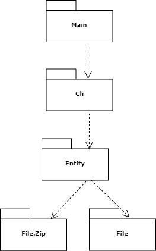

## Diagramma dei componenti
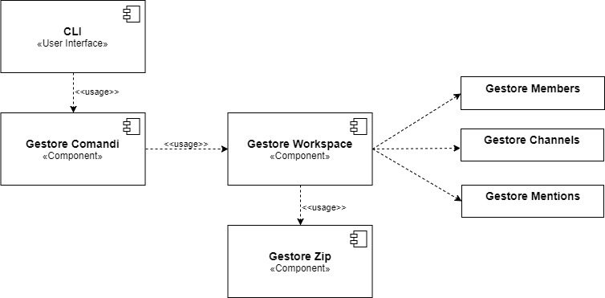

## Commenti relativi alle decisioni prese
Abbiamo progettato il sistema pensando ad una eventuale espansione software, in modo che l'implementazione di eventuali feature non sia, in futuro, particolarmente dispendiosa e difficoltosa ma che possa avvenire riutilizzando il codice già scritto e le funzioni già realizzate. In più questo stesso approccio è stato adottato dal gruppo durante l'implementazione delle nuove feature richieste dal professore.

# 5. System Design

## Diagramma delle classi e diagramma di sequenza dei requisiti funzionali
#### In qualità di utente voglio visualizzare la lista dei Member.
- _Diagramma di classe_  
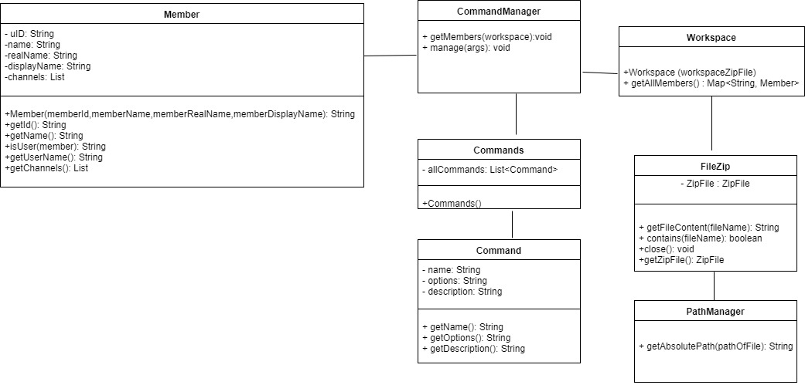

- _Diagramma di sequenza_  
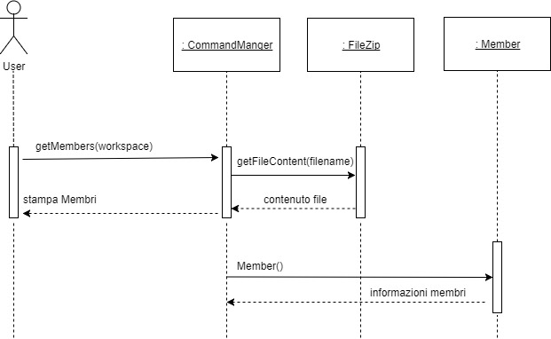

#### In qualità di utente voglio visualizzare la lista dei Channel.
- _Diagramma di classe_  
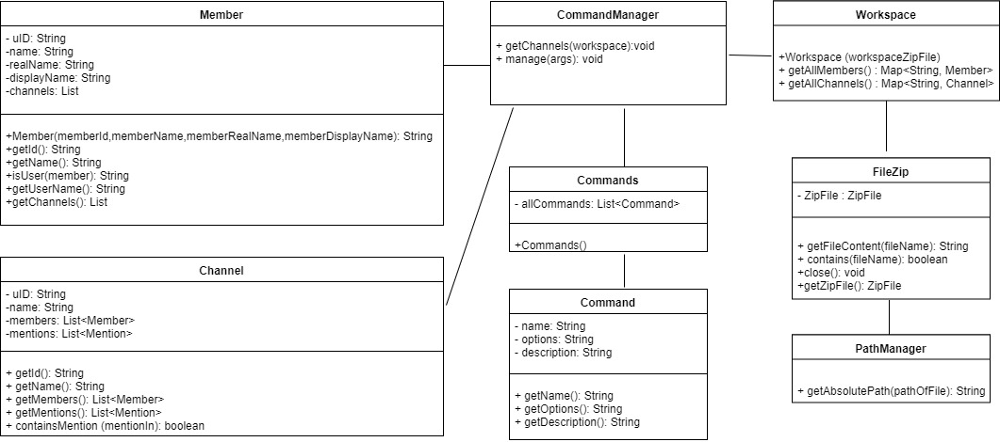

- _Diagramma di sequenza_  
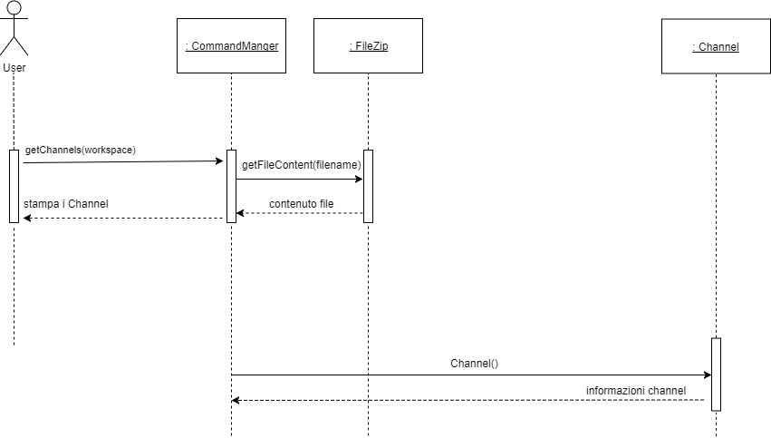

#### In qualità di utente voglio visualizzare la lista dei Member raggruppati per Channel.
- _Diagramma di classe_  
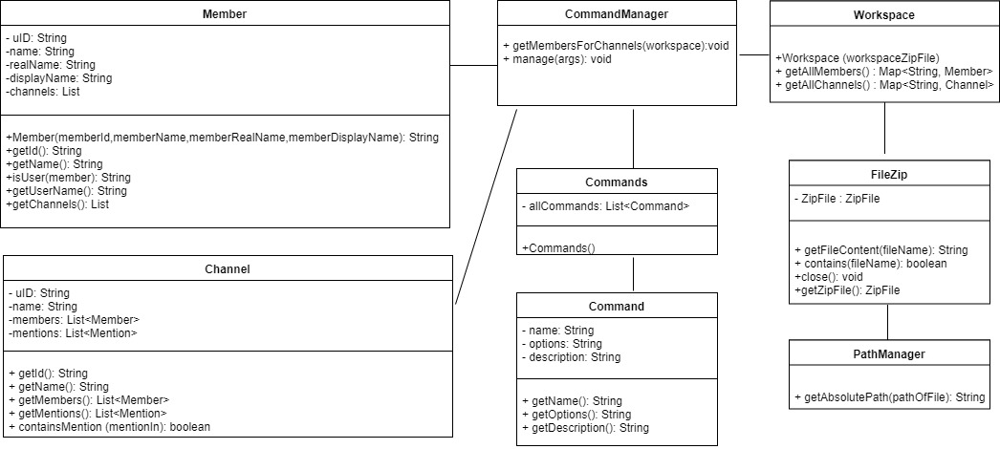

- _Diagramma di sequenza_  

#### In qualità di utente voglio visualizzare la lista dei Member di un Channel.
- _Diagramma di classe_  
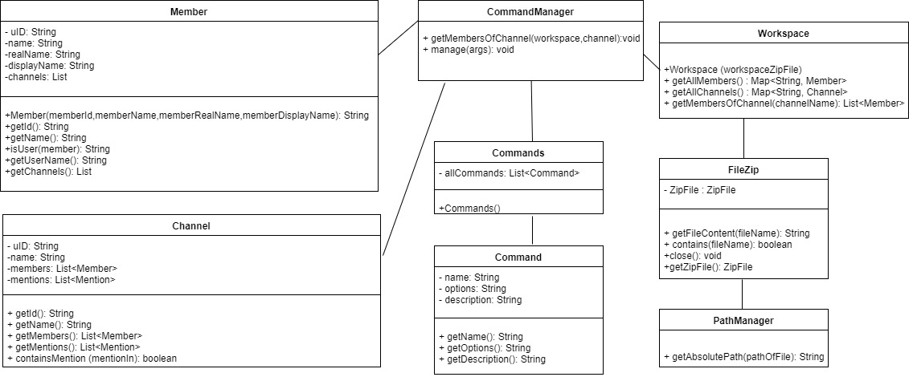

- _Diagramma di sequenza_  
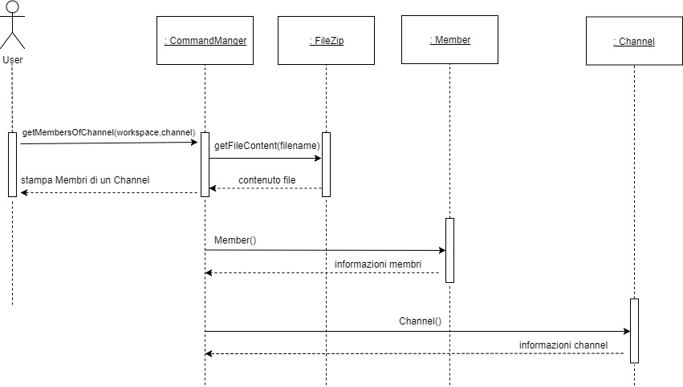

#### In qualità di utente voglio poter avere informazioni di help.
- _Diagramma di classe_  
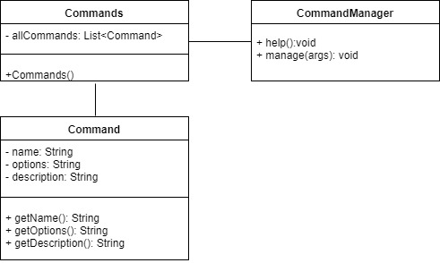

- _Diagramma di sequenza_  
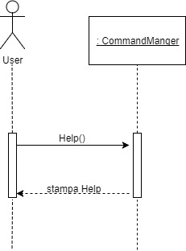

#### In qualità di utente voglio visualizzare la lista dei @mention.
- _Diagramma di classe_  
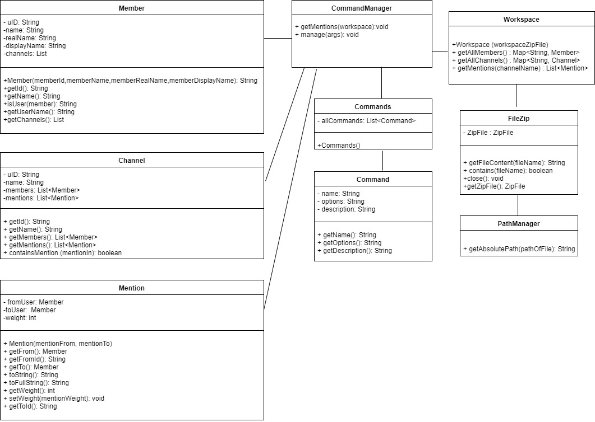

- _Diagramma di sequenza_  
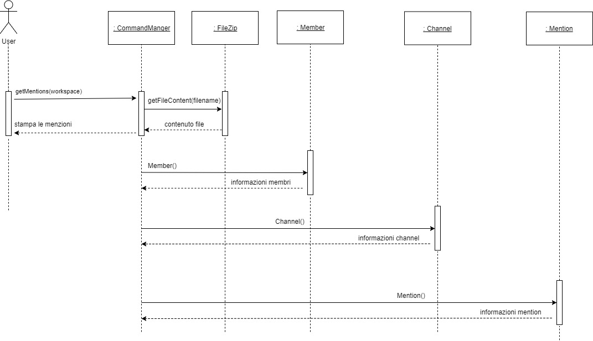

#### In qualità di utente voglio visualizzare la lista dei @mention che partono da uno User.
- _Diagramma di classe_  
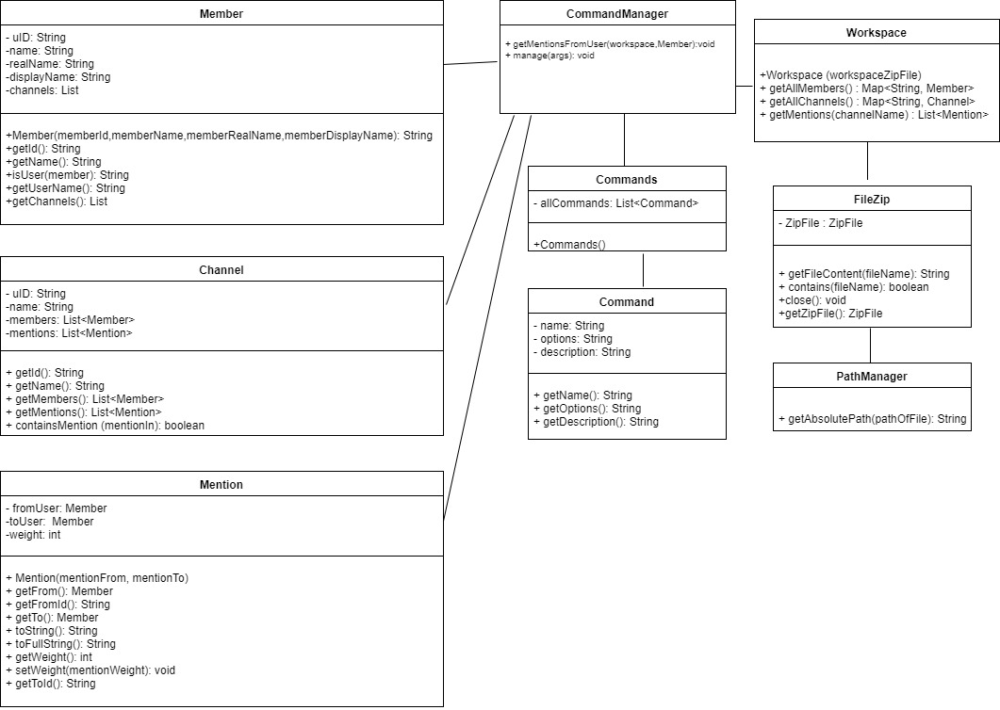

- _Diagramma di sequenza_  

#### In qualità di utente voglio visualizzare la lista dei @mention che arrivano a uno User.
- _Diagramma di classe_  
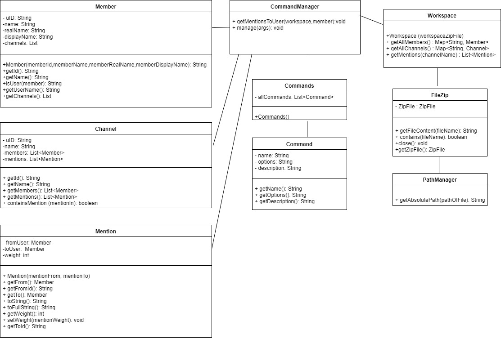

- _Diagramma di sequenza_  
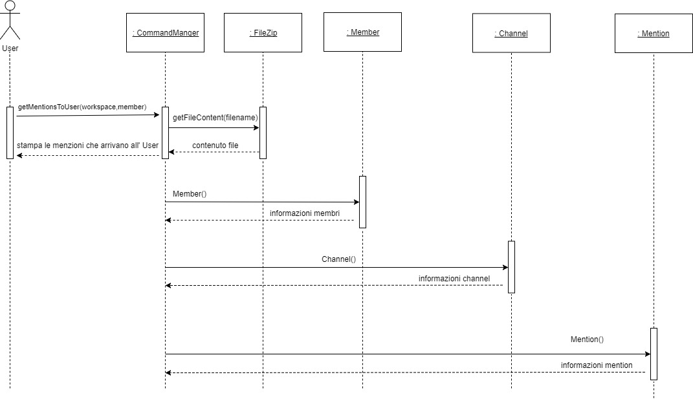

#### In qualità di utente voglio visualizzare la lista pesata dei @mention.
- _Diagramma di classe_  
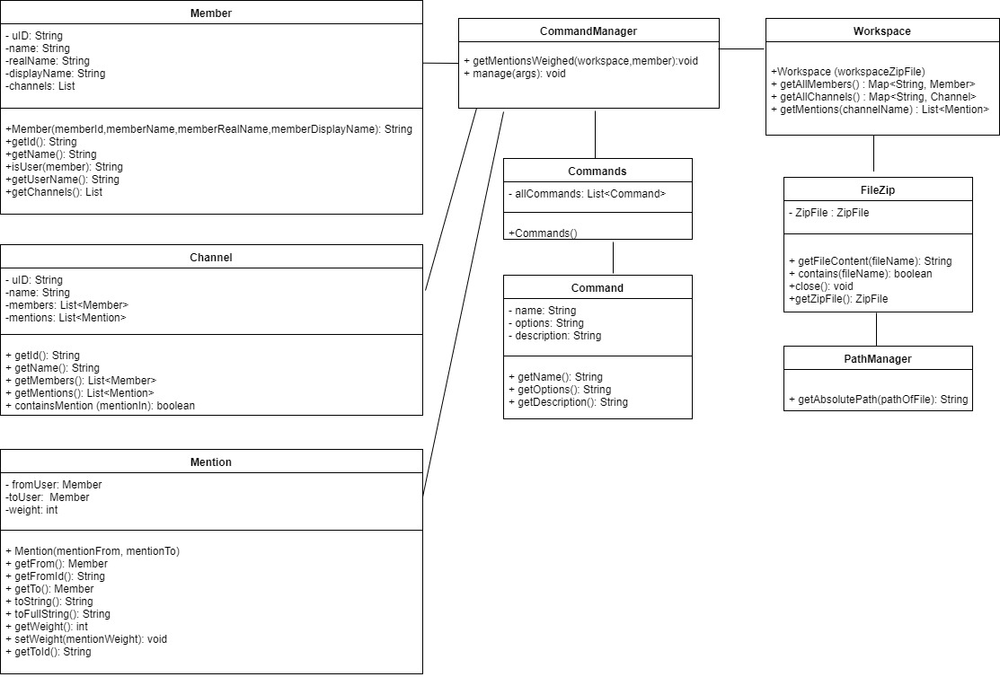

- _Diagramma di sequenza_  
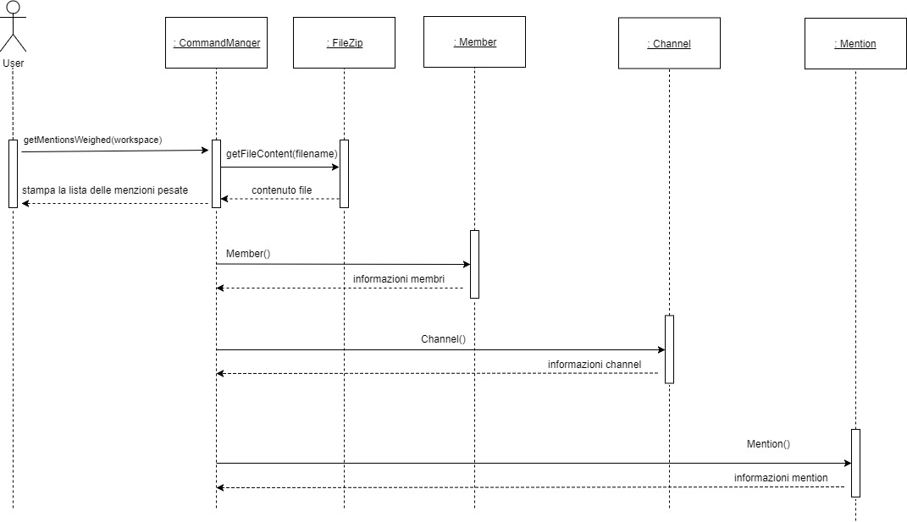

#### In qualità di utente voglio visualizzare la lista pesata dei @mention che partono da uno User.
- _Diagramma di classe_  
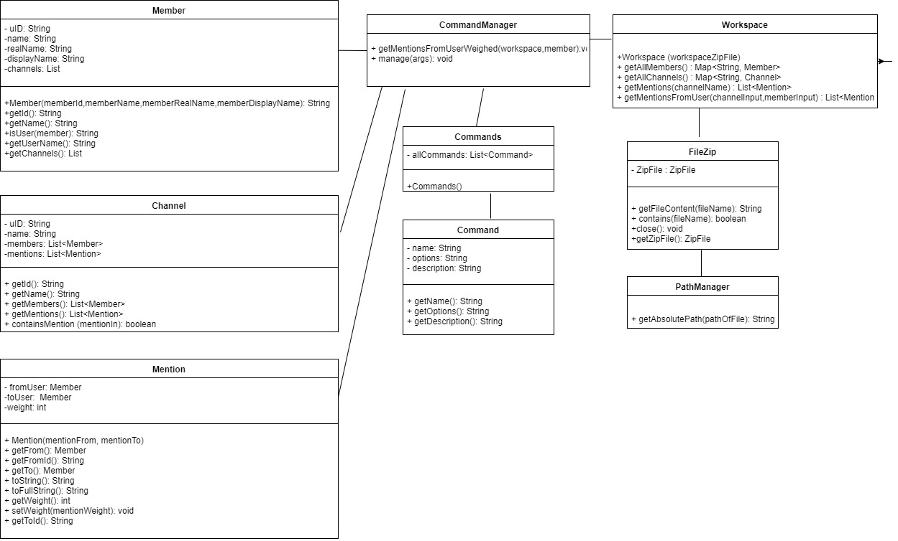

- _Diagramma di sequenza_  
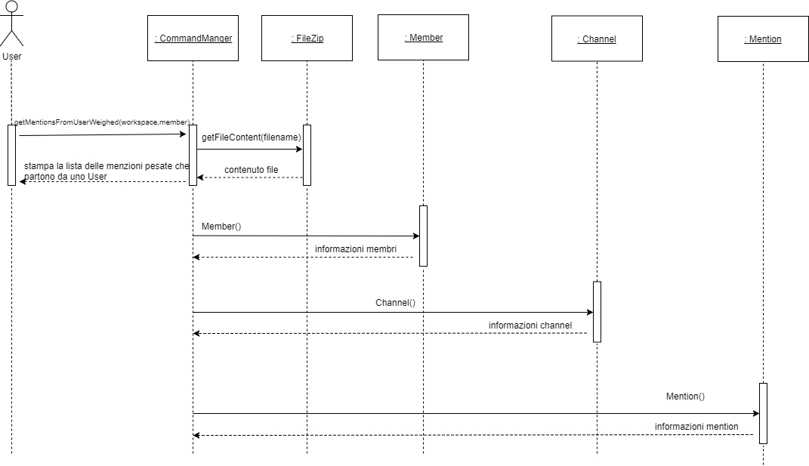

#### In qualità di utente voglio visualizzare la lista pesata dei @mention che arrivano a uno User.
- _Diagramma di classe_  
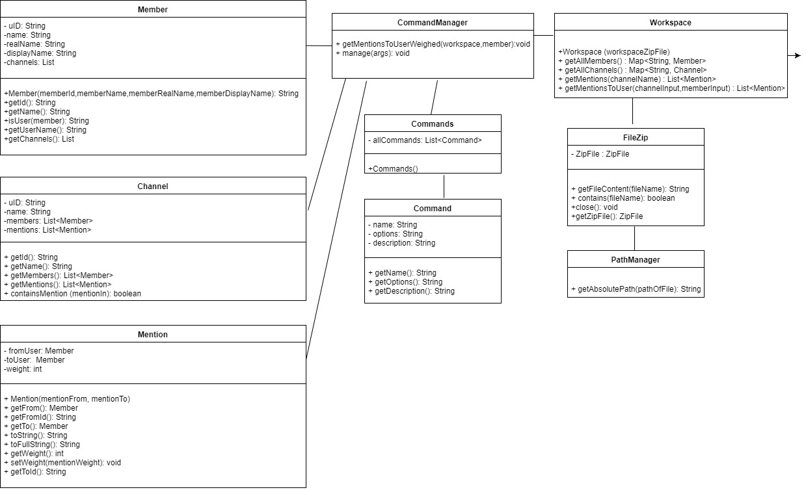

- _Diagramma di sequenza_  

## Menzionare l'eventuale applicazione di design pattern
Non abbiamo utilizzato alcun design pattern specifico.

## Giustificare le segnalazioni rimaste aperte di PMD
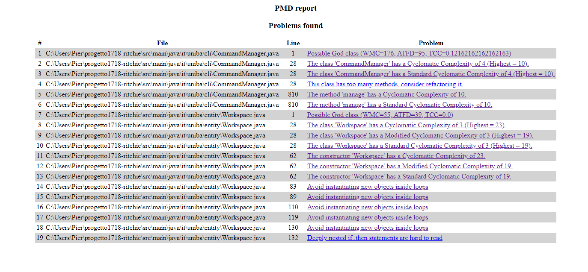
Per quanto riguarda le segnalazioni di PMD, le uniche segnalazioni rimanenti come quelle relative alle God Class CommandManager e Workspace, alla complessità ciclomatica di alcuni metodi, alla instanziazione di oggetti all'interno di cicli, agli if nidificati e alle classi contenenti troppi metodi sono state mantenute poichè la risoluzione degli stessi avrebbe portato alla modifica radicale della realizzazione del programma.  
Infatti, il programma è stato pensato con una certa struttura  risolvere questi particolari report di PMD avrebbe significato riprogettare completamente la struttura del programma e riscriverlo da zero il che, oltre ad essere dispendioso in termini di tempo, avrebbe annullato qualsiasi operazione realizzata negli sprint iniziali relativi alla vera e propra progettazione del programma, rendendo quindi la versione precedente del software completamente obsoleta. Non sarebbe neanche stato possibile riutilizzare il codice scritto in precedenza in quanto era necessaria la ristrutturazione completa di tutto il sistema.  
Questo perchè il programma è stato pensato per poter approfittare della gestione degli oggetti da parte di Java; Java infatti lavora con i riferimenti agli oggetti e non con gli oggetti stessi e questo ci ha permesso di poter implementare una relazione del tipo "molti a molti", fra le classi Channel e Member e ci ha anche permesso di poter lavorare sulla struttura del workspace più semplicemente e velocemente.  
Inoltre, la classe CommandManager ha molti metodi in quanto sono stati aggiunti un certo numero di metodi utilizzati per evitare di violare la legge di Demetra.

Per quanto riguarda le classi di test, tutte le segnalazioni riportate da PMD sono state risolte.

## Commentare le decisioni prese
Il sistema è stato disegnato e pensato in modo da poter sfruttare il funzionamento di Java; Java, infatti, lavora con i riferimenti dei vari oggetti. Abbiamo sfruttato questa caratteristica del linguaggio per poter gestire meglio ciascun Channel e ciascun Member. Il sistema, infatti, implementa una relazione "molti a molti" fra la classe Channel e la classe Member in modo da poter ottenere per ciascun Member la lista dei Channel a cui è iscritto e per ciascun Channel la lista dei Member appartenenti.
Per ogni Member abbiamo deciso di estrarre dal file JSON l'ID dell'utente, il name, il real name e il display name. Questo perchè il sistema, in questo modo, garantisce la copertura di tutti gli utenti qualora uno di essi non utilizzi uno dei parametri nome indicati in precedenza; l'ordine di gestione dei vari nomi è diplay name, real name, name ed infine id. Inoltre, tramite questo approccio, è possibile identificare da riga di comando ciascun utente sia con i vari parametri nome sia con l'id, in modo da poter disambiguare gli utenti nel caso di omonimi.
Abbiamo adottato l'utilizzo delle HashMap per poter elencare i Member e i Channel del Workspace. In questo modo, la ricerca e la gestione dei Member e dei Channel risulta più efficiente dell'implementazione mediante semplice Lista in quanto non si rende necessario lo scorrimento della lista stessa ogni volta che vi è la necessità di trovare un elemento nella struttura dati.
Per quanto riguarda la rilevazione delle mention, abbiamo preferito salvare direttamente le Mention all'atto della lettura dei messaggi dal file JSON piuttosto che il salvataggio dell'intero messaggio. Infatti abbiamo utilizzato le RegEx per rilevare direttamente le Mention all'interno dei messaggi.

# 6. Riepilogo del test
Il collaudo del software detto anche testing è un procedimento, che fa parte del ciclo di vita del softwere utilizzato per individuare le carenze di correttezza, completezza, e affidabilità delle componenti software.
La fase di  verifica e di  validazione  serve ad accertare che il  software rispecchi i requisiti e che li rispetti nella maniera dovuta.
Precisamente la verifica serve a stabilire che il software rispetti i requisiti e le specifiche, quindi ad esempio che non ci siano requisiti mancanti, mentre la validazione serve ad accertare che i requisiti e le specifiche siano anche rispettati nella maniera giusta.
Nello specifico nella nostra fase di verifica e validazione abbiamo svolto due principali attività di verifica e validazione : il testing (attività dinamica) costruendo casi di test con il supporto del framework JUnit, e l'analisi del codice (attività statica) attraverso strumenti come checkstyle, findbugs e PMD.
L'attività statica ci ha portati poi alla generazione automatica di report che riportiamo nel seguito.
#### Report di FindBugs
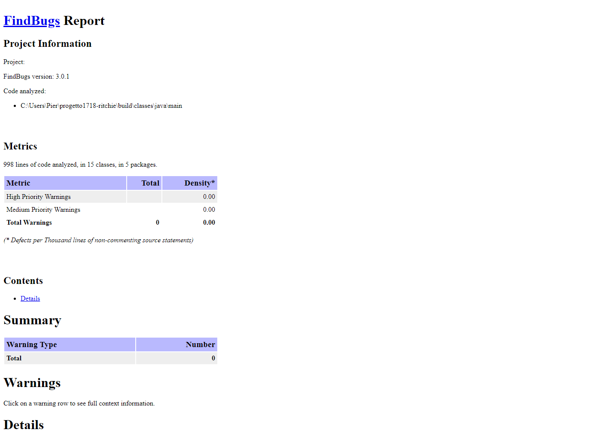
#### Report di Checkstyle
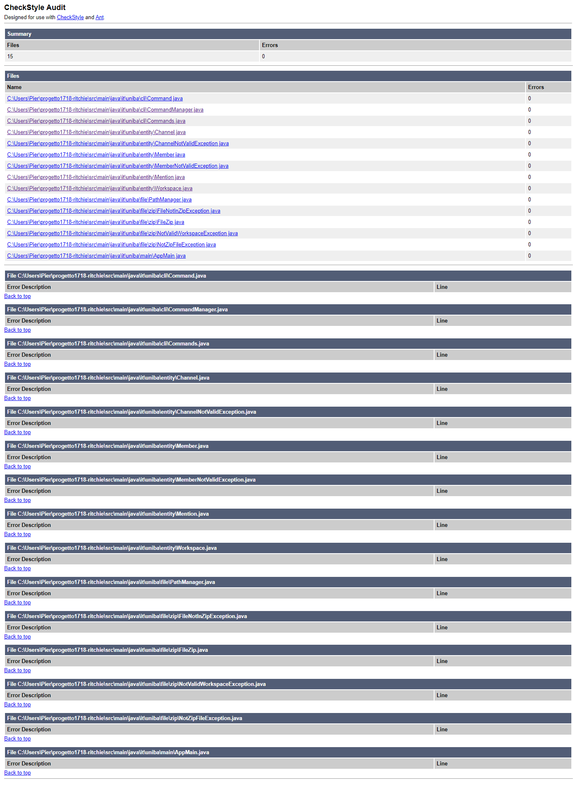
#### Report di PMD
- Classi principali

- Classi di test

Nella sezione relativa alle segnalazioni di PMD rimaste aperte è stato spiegato il perchè si è deciso di non risolvere certe segnalazioni.

In seguito riportiamo i report relativi ai test e alla copertura del codice
#### Report di Jacoco
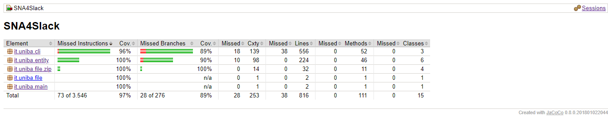
#### Report dei Test
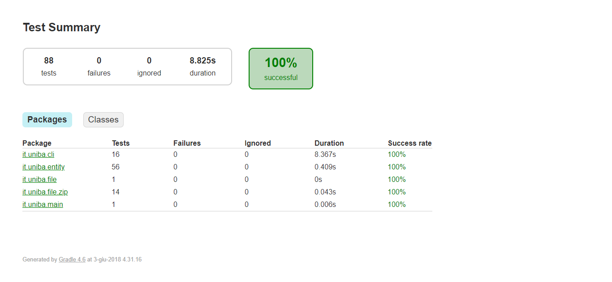

# 7. Manuale utente
La seguente tabella indica tutti i comandi del programma e la funzione che ognuno di essi svolge.

| Comando                 | Funzione svolta                                                                                                                                                                                                      |
|-------------------------|----------------------------------------------------------------------------------------------------------------------------------------------------------------------------------------------------------------------|
| `help` | Stampa la lista intera dei comandi che è possibile eseguire indicando anche la funzione svolta da ogni singolo comando. Si può richiamare l'help anche senza specificare alcun comando all'esecuzione del programma. |
| `members -f "fileName"` | Stampa la lista di tutti i membri del workspace relativo al file **fileName** esportato da Slack ed indicato fra virgolette.**fileName** indica il percorso, relativo o assoluto, del file .zip esportato da Slack. |
| `channels -f "fileName"` | Stampa la lista di tutti i canali del workspace relativo al file **fileName** esportato da Slack ed indicato fra virgolette. **fileName** indica il percorso, relativo o assoluto, del file .zip esportato da Slack. |
| `members -ch -f "fileName"` | Stampa la lista di tutti i membri, raggruppati per canale, del workspace relativo al file **fileName** esportato da Slack ed indicato fra virgolette. **fileName** indica il percorso, relativo o assoluto, del file .zip esportato da Slack. |
| `members -ch "channelName" -f "fileName"` | Stampa la lista di tutti i membri del canale **channelName** del workspace relativo al file **fileName** esportato da Slack ed indicato fra virgolette. **fileName** indica il percorso, relativo o assoluto, del file .zip esportato da Slack. **channelName** indica il nome del canale di cui ottenere i membri. |
| `mentions -f "fileName"` | Stampa la lista di tutte le mention del workspace relativo al file **fileName** esportato da Slack ed indicato fra virgolette. **fileName** indica il percorso, relativo o assoluto, del file .zip esportato da Slack. |
| `mentions -w -f "fileName"` | Stampa la lista di tutte le mention, con il relativo numero di volte che ogni mention appare (peso), del workspace relativo al file **fileName** esportato da Slack ed indicato fra virgolette. **fileName** indica il percorso, relativo o assoluto, del file .zip esportato da Slack. |
| `mentions -ch "channelName" -f "fileName"` | Stampa la lista di tutte le mention fatte nel canale **channelName** del workspace relativo al file **fileName** esportato da Slack ed indicato fra virgolette. **fileName** indica il percorso, relativo o assoluto, del file .zip esportato da Slack. **channelName** indica il nome del canale di cui ottenere le mention. |
| `mentions -w -ch "channelName" -f "fileName"` | Stampa la lista di tutte le mention, con il relativo numero di volte che ogni mention appare (peso), fatte nel canale **channelName** del workspace relativo al file **fileName** esportato da Slack ed indicato fra virgolette. **fileName** indica il percorso, relativo o assoluto, del file .zip esportato da Slack. **channelName** indica il nome del canale di cui ottenere le mention |
| `mentions -from "memberName" -f "fileName"` | Stampa la lista di tutte le mention fatte dall'utente **memberName** del workspace relativo al file **fileName** esportato da Slack ed indicato fra virgolette. **fileName** indica il percorso, relativo o assoluto, del file .zip esportato da Slack. **memberName** indica il nome dell'utente di cui si vogliono sapere le mention che ha fatto. |
| `mentions -w -from "memberName" -f "fileName"` | Stampa la lista di tutte le mention, con il relativo numero di volte che ogni mention appare (peso), fatte dall'utente **memberName** del workspace relativo al file **fileName** esportato da Slack ed indicato fra virgolette. **fileName** indica il percorso, relativo o assoluto, del file .zip esportato da Slack. **memberName** indica il nome dell'utente di cui si vogliono sapere le mention che ha fatto. |
| `mentions -from "memberName" -ch "channelName" -f "fileName"` | Stampa la lista di tutte le mention fatte dall'utente **memberName** nel canale **channelName** del workspace relativo al file **fileName** esportato da Slack ed indicato fra virgolette. **fileName** indica il percorso, relativo o assoluto, del file .zip esportato da Slack. **memberName** indica il nome dell'utente di cui si vogliono sapere le mention che ha fatto. **channelName** indica il nome del canale di cui ottenere le mention fatte dall'utente. |
| `mentions -w -from "memberName" -ch "channelName" -f "fileName"` | Stampa la lista di tutte le mention, con il relativo numero di volte che ogni mention appare (peso), fatte dall'utente **memberName** nel canale **channelName** del workspace relativo al file **fileName** esportato da Slack ed indicato fra virgolette. **fileName** indica il percorso, relativo o assoluto, del file .zip esportato da Slack. **memberName** indica il nome dell'utente di cui si vogliono sapere le mention che ha fatto. **channelName** indica il nome del canale di cui ottenere le mention fatte dall'utente. |
| `mentions -to "memberName" -f "fileName"` | Stampa la lista di tutte le mention fatte all'utente **memberName** del workspace relativo al file **fileName** esportato da Slack ed indicato fra virgolette. **fileName** indica il percorso, relativo o assoluto, del file .zip esportato da Slack. **memberName** indica il nome dell'utente di cui si vogliono sapere le mention che ha fatto. |
| `mentions -w -to "memberName" -f "fileName"` | Stampa la lista di tutte le mention, con il relativo numero di volte che ogni mention appare (peso), fatte all'utente **memberName** del workspace relativo al file **fileName** esportato da Slack ed indicato fra virgolette. **fileName** indica il percorso, relativo o assoluto, del file .zip esportato da Slack. **memberName** indica il nome dell'utente di cui si vogliono sapere le mention che ha fatto. |
| `mentions -to "memberName" -ch "channelName" -f "fileName"` | Stampa la lista di tutte le mention fatte all'utente **memberName** nel canale **channelName** del workspace relativo al file **fileName** esportato da Slack ed indicato fra virgolette. **fileName** indica il percorso, relativo o assoluto, del file .zip esportato da Slack. **memberName** indica il nome dell'utente di cui si vogliono sapere le mention che ha fatto. **channelName** indica il nome del canale di cui ottenere le mention fatte dall'utente. |
| `mentions -w -to "memberName" -ch "channelName" -f "fileName"` | Stampa la lista di tutte le mention, con il relativo numero di volte che ogni mention appare (peso), fatte all'utente **memberName** nel canale **channelName** del workspace relativo al file **fileName** esportato da Slack ed indicato fra virgolette. **fileName** indica il percorso, relativo o assoluto, del file .zip esportato da Slack. **memberName** indica il nome dell'utente di cui si vogliono sapere le mention che ha fatto. **channelName** indica il nome del canale di cui ottenere le mention fatte dall'utente. |

# 8. Processo di sviluppo e organizzazione del lavoro

## Stile di processo adottato
Un processo software descrive quali sono le attività che concorrono a sviluppare un prodotto software e come le attività sono collegate tra loro. 
Si assume che la qualità del processo implica la qualità del prodotto.
Ci sono due tipi di attività tipiche nello sviluppo ed evoluzione del software e sono : attività tecniche e attività organizzative.
Nel nostro caso all'interno del progetto:

Attività tecniche sono state:
- analisi dei requisiti (requirements analysis) effettutain ai aula
- progettazione (design) effettuata dal team valutando le possibili soluzioni ed adottando quella che in prospettive di ampliamento del progetto in termini di features,risultava più idonea
- realizzazione (implementation) suddivisa tra i membri del team in base a complessità
- collaudo (testing) 
- messa in esercizio (deployment)
- conduzione operativa (operation)
- manutenzione (maintenance)

Attività organizzative che includono:
- gestione del progetto (project management) 
- gestione della configurazione (configuration management)
- assicurazione della qualità (quality assurance).

Vi sono principalmente due stili di processo: a cascata ed iterativo.
In Sna4Slack è stato adottato uno stile di processo di tipo scrum e quindi iterativo e incrementale.

## Metodologia utilizzata per strutturare lo sviluppo dell'applicazione

Non esiste un modo unico per strutturare lo sviluppo del software fondamentalmente abbiamo sviluppo ad hoc, sviluppo pianificato e sviluppo agile.
Lo sviluppo di Sna4Slack è stato strutturato utilizzando lo sviluppo agile cercando di essere il più fedeli possibili a quanto riportato nel Manifesto per lo sviluppo agile. Il progetto è stato diviso in quattro sprint, ciascuno della durata di massimo 10 giorni, in cui sono stati definiti diversi obiettivi, anche detti goals, che prevedono il completamento di una lista di storie dette User-Story. L'assegnazione di ciascuna User-Story è avvenuta senza seguire un preciso schema. Principalmente abbiamo cercato di assegnare ad ogni sottogruppo la stessa tipologia di funzionalità nei vari sprint. Ogni sottogruppo era composto da massimo due persone. Inoltre, ogni sottogruppo poteva creare nuove issue relative ad una suddivisione in task delle User-Story o alla correzione e/o miglioria di funzionalità implementate precedentemente. Abbiamo utilizzato la board di GitHub per tracciare lo stato di ogni issue, utilizzando come struttura della board quella prevista da Scrum.
La board era suddivisa in quattro fasi, ognuna relativa ad una fase della realizzazione di ciascuna issue:
- **To do**: indica che l'issue è stata presa in carico da uno sviluppatore o da un sottogruppo, ma non ancora in fase di realizzazione;
- **In progress**: indica che l'issue è in fase di realizzazione;
- **In review**: indica che l'issue era in fase di revisione da parte di un membro del gruppo prima di poter effettuare un merge.
- **Done**: indica che l'issue è stata completata e chiusa e che è stato effettuato il merge del branch relativo all'issue sul master.

## Confronto tra il manifesto dello sviluppo agile e il lavoro svolto
 Considerando i principi sottostanti al manifesto si illustra come si è cercato di applicarli al progetto.
  
- La nostra priorità era quella di soddisfare al massimo le richieste del cliente che nel nostro caso era il professore cercando di rilasciare alla fine di ogni sprint software di valore.

- Anche a stadi avanzati dello sviluppo si è accettata la "sfida" di dover cambiare alcune cose.

- Consegnamo frequentemente software funzionante, con cadenza variabile , preferendo i periodi brevi.

- Per tutta la durata del progetto abbiamo avuto la possibilità di lavorare quotidianamente con il nostro committente ovvero con il professore.

- Il nostro team è stato fondato su individui motivati.

- I membri del team si sono impegnati nel ritagliarsi spazi per avere conversazioni con gli altri membri per lo meno per chiarirsi sul lavoro da fare e su quello che già si era svolto.
Se impossibilitati dalla distanza si sono utilizzati strumenti di comunicazione come Skype.

- Alla fine di ciascun sprint avere un software che funzionasse ci lasciava intuire che eravamo sulla giusta strada ma che si poteva sempre migliorare in termini di efficienza, pulizia e chiarezza del codice, abbiamo dunque utilizzato il software come  strumento di misura di un buon lavoro.

- Il team ha mantenuto indefinitamente un ritmo costante.

- Il team ha posto continua attenzione all'eccellenza tecnica e alla buona progettazione esaltano l'agilità.

- Si è puntato tutto sulla semplicità.

- Il team che si auto-organizzato per avere un'ottima performance.

- Spesso ci siamo ritrovato nel dover mettere in discussione la metodologia di lavoro che avevamo applicato.
Alla fine di ogni sprint ci rendevamo conto che avremmo potuto aggiungere qualcosa alla nostra metodologia.
Il primo sprint è risultato molto difficile non avevamo una metodologia di lavoro e i membri del gruppo si conoscevano poco fra loro.
Sprint dopo sprint la metodologia è migliorata e si è giunti ad un punto in cui lavorare è diventato più semplice.
Consideriamo la nostra metodologia ancora non perfetta al cento per cento.
Ma abbiamo avuto l'accortezza di migliorarci ogni qualvolta fosse necessario.

Come modello agile nello sviluppo di Sna4Slack si è scelto di adottare Scrum.

## Framework Scrum
Rispettando lo Scrum framework possiamo individuare all'interno del progetto:
- Ruoli
- Eventi
- Artifact

## Ruoli
- **Product owner**:
È responsabile del valore del prodotto.
Ha la responsabilità esclusiva di gestione del Product Backlog.
Definisce le caratteristiche funzionali e non funzionali (feature) del prodotto. Assegna le priorità alle feature in base al valore di mercato.
Adatta le feature e le priorità a ogni iterazione.
Accetta o rifiuta i risultati del lavoro del Team di Sviluppo In base a una definizione di “Done” (lavoro completo) compresa da tutto il Team di Sviluppo.
Il ruolo di Product owner in Sna4Slack è stato svolto dal professor Filippo Lanubile che aveva la la responsabilità di gestire il product backlog e che ha deciso i requisiti funzionali e non del sistema.

- **Scrum Master**:
È una guida al servizio del Team di Sviluppo e del Product Owner.
Aiuta a creare gli elementi del Product Backlog in modo chiaro e conciso.
Aiuta a ordinare gli elementi del Product Backlog per massimizzare il valore. Facilita gli eventi Scrum.
Rende trasparente il processo di sviluppo mediante visualizzazione delle informazioni chiave.
Anche in questo caso il ruolo è stato ricoperto dal professore e dal suo team.

- **Team**:
Soltanto rappresentato dai  membri del Team di Sviluppo che creano l’incremento da rilasciare alla fine di ogni Sprint.
La dimensione va dalle 3 alle 8 persone  vige la regola delle 2 pizze (americane). Necessaria in esso l'autogestione all’interno di uno Sprint.
I singoli membri possono avere competenze specialistiche e aree di interesse ma è il Team di Sviluppo nel suo complesso ad avere la responsabilità finale.
Il team nel nostro caso era formato da 5 persone (valore intermedio fra 3 e 8).
Ciascuno di noi ha sviluppato di volta in volta la parte assegnatali e ha supportato quando necessario compagni del team in difficoltà, così da poter giungere all' obiettivo di ciascuno sprint.

## Eventi 
- **Sprint planning**:
Valutazione delle priorità nel Product Backlog.
Vi è una scelta dello Sprint Goal.
Selezione degli item da completare nello Sprint.
Creazione dello Sprint Backlog.
Identificazione dei Task e stima di ciascuno di essi.
Effettuato all'inizio di ciascuno sprint in aula concordando con il professore i possibili item da completare nello sprint.

- **Daily scrum meeting**:
Effettuato tutti i giorni per all'incirca 15-minuti solitamente in piedi.
Vengono poste tre domande: – Cosa hai fatto ieri? – Cosa farai oggi? – Ci sono problemi? 
Sono tutti invitati ma solo i membri del team, lo Scrum Master e il Product owner hanno diritto di parola.
Nel nostro caso era fatto ciascun giorno fra i membri del team in aula studio prima delle lezioni se impossibilitati dalla distanza lo si effettuava su Skype.

- **Sprint review**:
Il team presenta i risultati raggiunti durante lo Sprint.
Viene presentata una demo delle nuove funzionalità o dell’architettura sottostante.
Nel nostro caso alla fine di ogni sprint si effettuava la consegna di un prodotto che realizzasse le funzionalità stabilite all'inizio di ogni sprint.

- **Sprint retrospective**:
Periodicamente si analizza cosa sta funzionando e cosa no.
Si discute su cosa introdurre ,cosa evitare e cosa continuare nel prossimo sprint.
Tipicamente dura da 15 a 30 minuti.
Fatta al termine di ogni sprint.
Partecipa tutto il team possibilmente anche i clienti.
Nel nostro caso era fatto alla fine di ogni sprint in aula con il professore.

## Artifact  
- **Product backlog**:
Non è altro che una lista di tutto il lavoro richiesto sul progetto.
E' L’unica fonte di requisiti per le modifiche da apportare al prodotto.
È dinamico e cambia continuamente.
Nella prima stesura contiene solo i requisiti inizialmente conosciuti e meglio compresi.
Le priorità sono stabilite dal Product Owner e aggiornate all’inizio di ogni sprint.
Le stime degli item pronti per uno Sprint sono stabilite dal Team di Sviluppo.
La stesura del Product backlog è avvenuta in classe da parte del professore il quale ha stabilito tutto il lavoro richiesto in Sna4Slack.
Le stime di ciascun item pronti per uno sprint sono state stabilite in aula, a ciascun item all'inizio di ciascuno sprint ogni item prendeva story point scelto in accordo con il professore.

- **Sprint backlog**:
L'insieme degli elementi del Product Backlog selezionati per lo Sprint più un piano per fornire l'incremento del prodotto e realizzare lo Sprint Goal.
La gestione è di esclusiva pertinenza del Team di Sviluppo.
Il lavoro non è assegnato da un project manager.
Quando del nuovo lavoro risulta necessario, il Team di sviluppo lo aggiunge allo Sprint Backlog.
Se alcuni elementi del piano non sono più ritenuti utili, sono rimossi.
La stima del lavoro rimanente è aggiornata nel daily meeting.
Il nostro sprint backlog è stato scritto in aula decidendo quali feature implementare da quelle del product backlog.
A ciascun sprint backlog sono stati aggiunti dai membri del team elementi che risultavano essere necessari per lo sviluppo degli elementi stabiliti per lo sprint corrente.

# 9. Analisi retrospettiva
## Cosa ha funzionato bene e rifaremmo in futuro?

Analizzando il lavoro svolto ci rendiamo conto che implementando il metodo Scrum abbiamo trovato il modo più proficuo per gestire il team e occuparci al meglio del progetto che ci è stato affidato, cosa che in esperienze di team project precedenti non è stata presente. 
Scrum è il metodo Agile più diffuso, basato sull’interazione continua con il cliente.
Lo scopo è assicurare un lavoro rispondente alle esigenze del cliente e di qualità. 
In questo modo abbiamo aumentiamo la nostra produttività e competitività.
Questo metodo, nato in contesto informatico, è adatto alla gestione di tutti i progetti innovativi e complessi e facilita l’interazione tra i membri del team con competenze multidisciplinari, a vantaggio del cliente.
Il risultato, infatti, è una realizzazione più veloce, trasparente e soddisfacente del progetto affidato dal cliente.
Poiché Agile sottolinea l'importanza del miglioramento continuo avere una regolare retrospettiva è una delle più importanti pratiche di sviluppo Agile; infatti, l’ultimo, ma non per importanza, principio Agile, delineato nel manifesto per lo sviluppo Agile afferma: "A intervalli regolari, il team riflette su come diventare più efficace, quindi sintonizza e regola il suo comportamento di conseguenza." In conclusione, abbiamo appreso che il metodo Agile ci ha fornito una metodologia strutturata per capitalizzare l’esperienza acquisita e per creare specifici piani di miglioramento dei prossimi progetti o eventuali prossime fasi del progetto.
Durante lo sviluppo del progetto il team ha potuto apprezzare l’efficacia e l’efficienza di alcuni software, alcuni  già utilizzati ed altri utilizzati per la prima volta.
Sicuramente saranno messi in atto per eventuali altre occasioni di lavori di gruppo. Riportiamo nel seguito i software che hanno contribuito fortemente alla riuscita di questo progetto:
- **Slack**, ovvero lo stesso software su cui si basa questo progetto. È una piattaforma per la comunicazione interna ai gruppi di lavoro, il cui slogan è: "tutti i tuoi messaggi in un unico posto, tutto istantaneamente accessibile alla ricerca, dovunque tu sia". Gratuita ed accessibile sia su dispositivi mobili  iOS e Android, che su desktop, compatibile con sistemi Windows e Mac. L'app appare come una classica applicazione di messaggistica, con in più la possibilità di integrare una lunga lista di servizi, fra i quali Dropbox, GitHub (fortemente utilizzato per restare aggiornati sullo sviluppo delle issue dai vari membri del team), Google Drive e Hangouts, Twitter.  Ci si accede registrando il dominio del proprio team. Una volta registrati, gli utenti del team possono suddividere gli argomenti di discussione e scambio file utilizzando hashtag; in questo modo si creano canali tematici. La promessa di Slack è quella di una diminuzione, fin quasi all'azzeramento, del flusso di email fra membri del team: è questa caratteristica che ha portato la stampa statunitense a definire Slack l'app "email killer". Possiamo affermare, in questa retrospettiva, che Slack si è confermato come uno strumento di lavoro adatto a per facilitare la comunicazione tra colleghi e gruppi di lavoro: in un unico “luogo”; si è potuto accedere facilmente a documenti linkati e ricevere notifiche specifiche ogni volta che si viene menzionati. Rendendo lo smart working sempre più facile e accessibile.
- **Skype** è un software di messaggistica istantanea e VoIP. Il programma consente di  lavorare a stretto contatto con un team di colleghi, con le chiamate di gruppo su Skype, comprese le conferenze telefoniche e le chat di gruppo. È stato uno strumento molto utile data la distanza tra i vari membri del team per effettuare i Daily Scrum Meeting, Sprint daily e fornire supporto ai colleghi, in particolar modo nella fase iniziale grazie alla possibilità di condivisione dello schermo presente durante le conference call. 
- **GitHub** è un sistema di  hosting per progetti software. Il tool è stato usato dal team traendone vantaggio, in quanto ciascun membro poteva caricare codice sorgente relativo alla parte presa in carico, in modo parallelo. Ognuno quindi aveva in qualsiasi momento la versione aggiornata del progetto e poteva interagire con lo stesso tramite un sistema di issue tracking, pull request e commenti che permette di migliorare il codice della repository risolvendo bug o aggiungendo funzionalità. Inoltre è stato possibile in caso di errori poter riportare il lavoro a stati precedenti.
- **Travis CI** è uno strumento di continuous integration, pratica sempre più diffusa nel mondo dello sviluppo software moderno. È un servizio online che funziona con GitHub,e una volta che abbiamo collegato i due account e configurato un file molto semplice nel nostro progetto, viene automaticamente attivato quando “pushiamo” sul nostro repository GitHub.  Si prende cura di compiti quale la qualità del codice stesso, controllando se abbiamo introdotto regressioni, presenza di bug e corretta integrazione dei componenti sviluppati da una squadra di programmatori, specie in progetti Software molto grandi , dove ognuno lavora su rami personali, quindi quando il codice è stabile è fuso con il master. Questo ci ha fatto risparmiare molto tempo che abbiamo utilizzato per scrivere effettivamente codice.
- Il tool **Coveralls.io** esegue test e controlla la percentuale del codice sorgente che è coperta dai test, producendo un bel report che ci mostra la percentuale per ogni singolo file/modulo e anche le linee di codice che sono state testate. Grazie a Coversals.io e all’uso di Travis, anche queste attività sono completamente automatizzate: dopo una build di Travis, conclusa con successo, viene eseguito il controllo sulla copertura dei casi di test.

## Cosa non ha funzionato bene e non rifaremmo in futuro?

Conoscere principi, strutture e metodi del modello Agile non fa di noi dei bravi progettisti e sviluppatori, se non vengono integrati da un'esperienza continua, da flessibilità e adattamento alle situazioni e da un certo numero di "trucchi" del mestiere.
Entrando più nel dettaglio, nell'analisi retrospettiva, i membri del gruppo convergono principalmente su tre punti:
- _mancanza di visione globale_: dopo aver terminato il primo sprint ci siamo accorti di una mancanza della visione globale del progetto: nello specifico l'obiettivo da raggiungere non era chiaro e condiviso. 
Per tale motivo abbiamo avuto difficoltà a far convergere le varie idee in un unica direzione condivisa, ma ricapitolando velocemente le richieste iniziali del committente siamo riusciti a riprendere l’attività proseguendo tutti nella stessa direzione.
Ciò non sarebbe accaduto se avessimo avuto a priori una visione globale del progetto.
- _mancanza di conoscenza specialistica_: imbattendoci in tecnologie di cui nessuno era esperto non conoscendo la soluzione migliore ciascuno tentava di far prevalere la propria, perdendo di vista quello che più contava ovvero la semplicità nell’utilizzo e l’efficienza. Ciò ci ha portati alla decisione di dover studiare approfonditamente l’argomento e successivamente riprendere una discussione su quale fosse la soluzione migliore.
Alla luce di questo, se il team fosse stato composto da persone con conoscenze eterogenee, saremmo giunti ad una soluzione in minor tempo.
- _gruppo stanco_: Durante l’analisi retrospettiva del progetto ci siamo resi conto che il team risulta essere stanco dopo uno sprint molto impegnativo che ha previsto attività di revisione e modifiche del progetto. Ciò che avevamo pianificato non rispecchiava a pieno le esigenze per questo lo sforzo è stato maggiore. Da ciò abbiamo imparato a non posticipare mai il lavoro quando vi è la possibilità di poterlo a termine con largo anticipo e di eseguire una progettazione più dettagliata.

